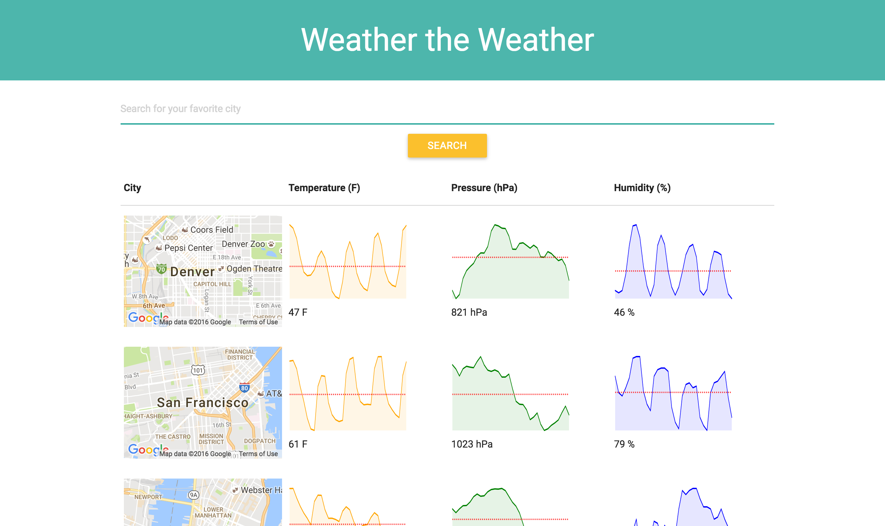

# Weather the Weather

A real-time weather app that uses React.js, Redux, and Webpack.
Check in out live: http://karigiberson.com/weather-search/

## Intention

Implementing the Open Weather Map API, Weather the Weather allows you to check real-time weather data for any city in the United States.

## License

MIT License
